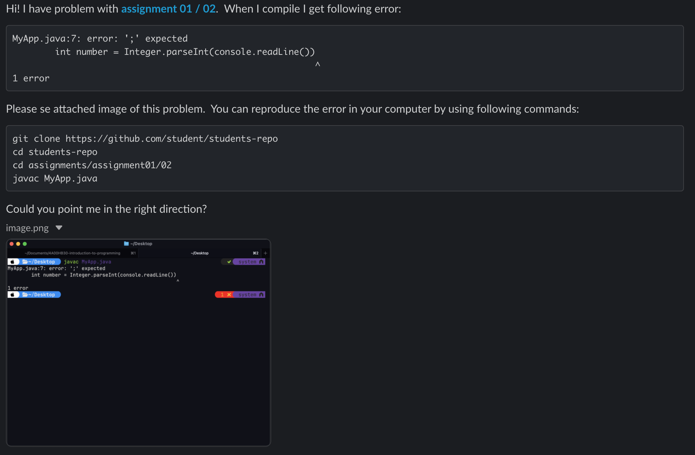
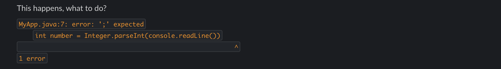

# 💬 Communication

- **Preferred method:** Use **Slack** for communication.
- **For security-sensitive matters:** Use **email** instead.

## 📌 Best Practices for Asking Programming Questions on Slack

> Helping you get faster, better answers by asking smart questions.

To facilitate effective and efficient communication on Slack, especially regarding programming questions, follow these guidelines when seeking assistance.

### Good Example of Slack usage:



### Bad Example of Slack usage:



---

### 1️⃣ Be Clear and Concise

- **State Your Objective:** Begin with a clear statement of what you're trying to achieve or the problem you're facing.
- **Assignment Context:** Mention what assignment and exercise you're working on.
- **Provide a Link:** Include a link to the assignment if available.

### 2️⃣ Provide Necessary Details

- **Error Messages:** Include any error messages or output that you're encountering, verbatim.
- **Relevant Code:** Share only the relevant portion of your code that is causing the issue. Use proper formatting.
- **Command Used:** Share the command you used, where you ran it, and what it returned.
- **What You've Tried:** Mention what solutions or debugging steps you've already attempted.
- **GitHub Repository:** Provide a link to your GitHub repo so others can explore the full code context if needed.

### 3️⃣ Format Your Question Properly

- **Code Blocks:** Use Slack's code block (triple backticks ```) for sharing code or error messages to improve readability.
- **Screenshots:** Include screenshots when necessary, but prefer text for logs and code snippets so they can be copied and searched.

### 4️⃣ Tag People and Use Channels Wisely

- **Relevant Channels:** Post your question in the most appropriate channel.
- **Direct Messages:** Use DMs for specific queries, but respect the recipient's time and availability.

### 5️⃣ Follow Up and Give Feedback

- **Update the Thread:** If you solve the issue, post your solution or a summary.
- **Appreciation:** Acknowledge the help you receive. It encourages community support.

### 6️⃣ Respect Everyone's Time

- **Initial Research:** Try solving the problem yourself using documentation or search engines.
- **Be Patient:** Helpers have their own tasks and responsibilities.
- **Reproducibility:** Give exact steps to reproduce the issue, including necessary commands like:

  ```sh
  git clone https://url-to-repository && cd path/to/assignment && compile-command && run-command
  ```

---

### ✅ Quick Checklist Before You Post

- [ ] Did I explain what I'm trying to do?
- [ ] Did I include error messages and commands?
- [ ] Did I link to my code or GitHub repo?
- [ ] Did I link to the assignment?
- [ ] Did I show what I've tried already?
- [ ] Did I format everything clearly using code blocks?
- [ ] Did I include commands how to reproduce the error?

By following these best practices, you'll make it easier for others to understand and help with your programming questions, leading to more effective problem-solving on Slack.
