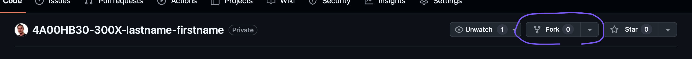
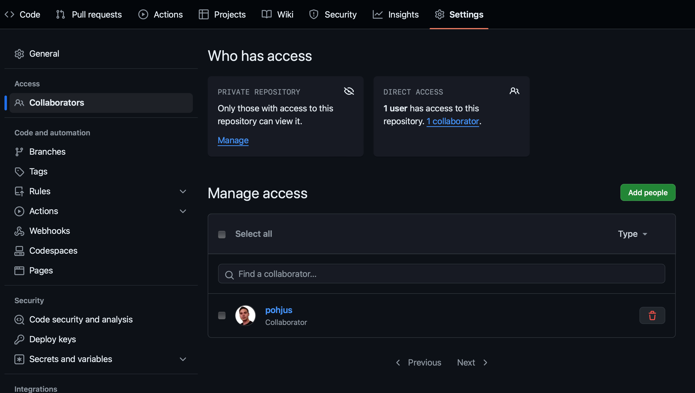
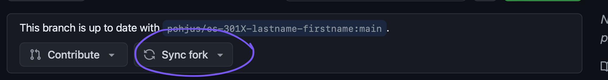

# 📂 Git Instructions

Log in with your account to [GitHub](http://github.com).

Open the GitHub url your teacher has given to you (should be in Google Sheets). You should have access to this private repository.

⚠️ Permissions to this repo has been added to students who have github account name in **Google Sheets** ⚠️

Click the “fork” button.



A GitHub repository fork is a personal copy of someone else's repository that exists in your GitHub account. Forking a repository _allows you to make changes to the original codebase without affecting the original repository_.

When you fork a repository, you create a new repository under your GitHub account that contains all the files and history of the original repository.

When the original repository (often referred to as the _"upstream"_ -repository) is changed—whether through new commits, updates, or other modifications—you can pull those changes into your forked repository to keep it up to date. This process involves fetching the latest changes from the original repository and then merging them into your fork.

So basically when teacher adds new assignment to the original github repo, you can pull those to your forked repo.

- Change the repository name to reflect your course and name, for example:
  - `https://github.com/pohjus/4A00HB30-300X-introduction-to-programming-lastname-firstname`
    - Notice `lastname-firstname`, not
      - `firstname-lastname` or
      - `Lastname-Firstname` or
      - `Firstname-Lastname`
    - Notice to change the number `300X` to reflect your course.
    - If you make a mistake, you can change this later on in repo settings.
- Click _Create fork_

Then check that pohjus is collaborator, if not, then add:



⚠️ REMOVE ALL OTHER collaborators! ⚠️, to do this, select all and then deselect `pohjus`.

Now you can clone the forked repo to your computer:

```sh
git clone https://github.com/....
```

And add your assignment:

```sh
git add -A
git commit -m "message"
git push
```

If you want the latest updates and assignment files from the teacher use the sync fork button.



Add also you repository link to your Google Sheets.

## 💡 Tips

If having **merge conflicts**:

1. Go to your fork on GitHub.
2. Click on "Pull requests".
3. Start a new pull request.
4. Set the base to your fork’s main, and the compare to upstream/main.
5. Example:
   - base: student/main
   - compare: pohjus/main (upstream)
6. This creates a pull request from upstream into the fork — essentially asking to pull the changes from the original repo into the fork.

# Summary Comparison

| Method               | Sync Fork Button | Manual Pull Request                        |
| -------------------- | ---------------- | ------------------------------------------ |
| No conflicts         | ✅               | ✅                                         |
| Conflicts            | ❌ Fails         | ✅ Allows editing conflicts in the browser |
| Flexibility          | 🚫 Auto-only     | ✅ Full control over what gets merged      |
| Merge commit message | Automatic        | Student can write their own commit message |

---

Or you can try

```sh
# Step 1: Add the original repository (upstream) to the local repository (only needed once)
git remote add upstream https://github.com/pohjus/...

# Step 2: Verify that the remotes are set correctly
git remote -v

# Step 3: Fetch the latest changes from the original (upstream) repository
git fetch upstream

# Step 4: Check the current branch (ensure you're on main before merging)
git branch

# Step 5: Switch to the main branch (if not already on it)
git checkout main

# Step 6: Merge the upstream changes into the local main branch
git merge upstream/main

# Step 7: If there are conflicts, resolve them manually, then mark as resolved
# Open conflicted files, edit them, then use:
git add <filename>

# Step 8: Commit the merge if necessary
git commit

# Step 9: Push the updated main branch to the student's fork on GitHub
git push origin main
```
